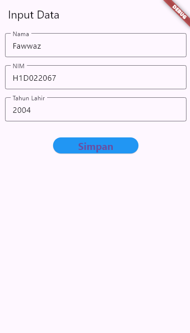
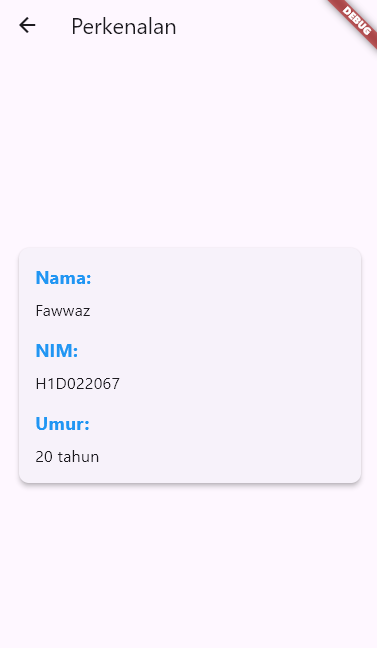

# Tugas Pertemuan 2

Nama : Fawwaz Afkar Muzakky
NIM : H1D022067
Shift Baru: C

# Proses Passing Data dari Form Menuju Tampilan
Berikut adalah tahapan alur passing data dari form ke tampilan:

### Form Data:
1. Pada halaman untuk input (`form_data.dart`), User mengisi form pada setiap textbox nama, nim, dan tahun lahir yang menggunakan widget TextField yang akan menerima input dari user.
2. Setelah klik tombol simpan, akan terpanggil method `_tombolSimpan()` di file `form_data.dart`, kemudian data yang di input oleh user diambil dari controller `_namaController`, `_nimController`, dan `_tahunController`, lalu data tersebut disimpan dalam variabel `nama`, `nim`, dan `tahun`.
3. User akan diarahkan ke halaman tampilan data dengan menggunakan `Navigator.of(context).push(MaterialPageRoute(builder: (context) => TampilData(nama: nama, nim: nim, tahun: tahun)))`.

### Tampil Data:
1. Pada halaman tampilan data (`tampil_data.dart`), data yang diterima dari form (`nama`, `nim`, dan `tahun`) akan ditampilkan.
2. Pada method `build()` di file `tampil_data.dart`, data tersebut digunakan untuk menghitung umur dengan mengurangi tahun lahir dari tahun sekarang.
3. Data nama, nim, dan umur ditampilkan dengan menggunakan widget `Text` pada tampilan.

## Screenshot tampilan form dan hasil

